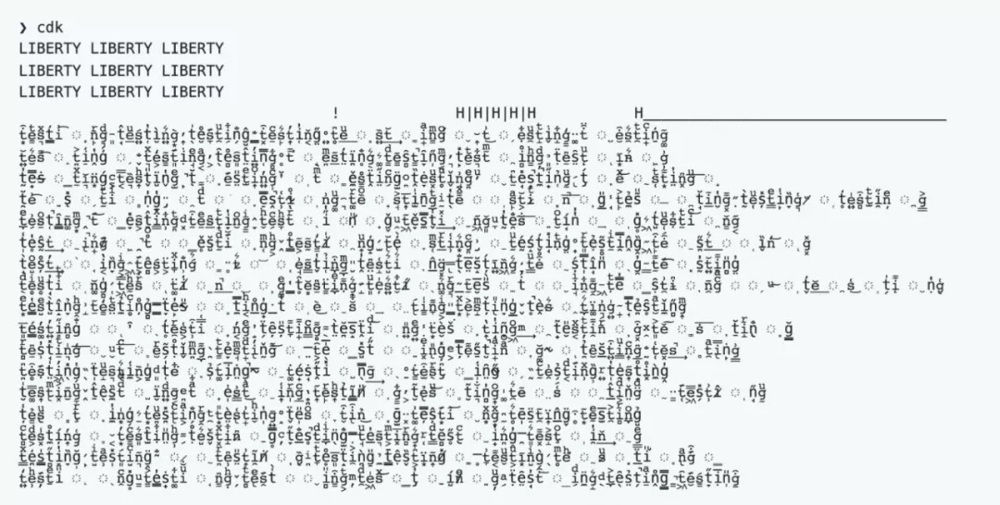

### 技术
1. [naivue ui 组件](https://www.naiveui.com)
2. [faker.js](https://github.com/marak/Faker.js/)
    faker.js 的作者删库了
    可能会碰到的问题（我反正是中招了）[文章](https://www.jiqizhixin.com/articles/2022-01-10-2)

3. [JavaScript Rising Stars](https://risingstars.js.org/2021/en)
    第 6 版 JavaScript Rising Stars
4. [CSS in 2022](https://www.bram.us/2021/12/27/css-in-2022/)
5. [性能优化，有时候是件体力活](https://mp.weixin.qq.com/s/_BKgmMtC6n3mAznCKDQUyA)
6. [React-pdf](https://github.com/diegomura/react-pdf)
    This package is used to create PDFs using React. If you wish to display existing PDFs, you may be looking for [react-pdf](https://github.com/wojtekmaj/react-pdf)
7. [quick-lint-js](https://quick-lint-js.com/)
   [ Over 110× faster than ESLint](https://quick-lint-js.com/benchmarks/), quick-lint-js gives you instant feedback as you code. Find bugs in your JavaScript before your finger leaves the keyboard. Lint any JavaScript file with no configuration.
    😔 但是还不支持 JSX 语法（在 React 代码中使用）
8. [roughViz:手写稿风格图标库](https://github.com/jwilber/roughViz)
9. [perspective:快速数据流可视化工具](https://perspective.finos.org/)
10. [vantajs:网站动画背景工具](https://www.vantajs.com/)
11. [slidev:Presentation slides for developers](https://github.com/slidevjs/slidev)
### 其他
1. 上周任务太零散，导致有些小需求忘记做了，该死该死