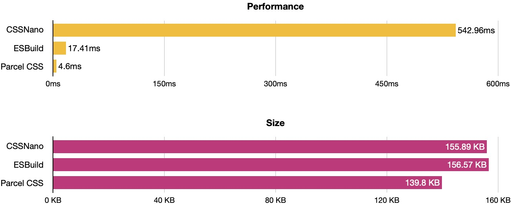
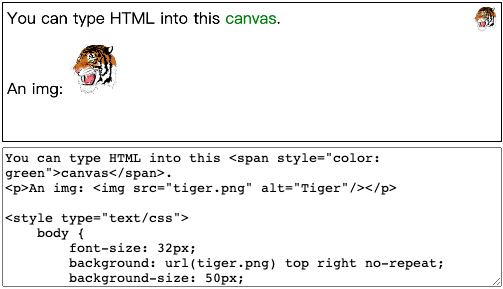

### 技术
1. [Monio:函数式编程库](https://github.com/getify/monio)<br />
``` 
Just("Welcome, Monads")
.concat(Just(" And Friends"))
.map(v => v.toUpperCase())
.fold(Maybe.from)
.map(v => v + "!")
.fold(
    () => IO.of("--empty--"),
    greetings => IO(() => console.log(greetings))
)
.run()
```
2. [remix vs nextjs](https://remix.run/blog/remix-vs-next)<br />
3. [parcel:css 编译](https://github.com/parcel-bundler/parcel-css)<br />
采用 rust 编写：benchmarks 如下

1. [astro：静态站点构建](https://astro.build/)
2. [umbrella JS：jQuery 轻量级代替品](https://github.com/franciscop/umbrella)
3. [scala JS](https://www.scala-js.org/)
4. [tinyBase：结构化状态库](https://github.com/tinyplex/tinybase)
5. [mo Js： 逐帧动画库](https://mojs.github.io/)
6. [rockpack：react 服务端渲染库](https://github.com/AlexSergey/rockpack)
7. [rasterizeHTML JS：在 canvas 中渲染 HTML](https://github.com/cburgmer/rasterizeHTML.js)<br />
    
9. [zustand：状态管理库](https://github.com/pmndrs/zustand)<br />
A small, fast and scalable bearbones state-management solution using simplified flux principles. Has a comfy api based on hooks, isn't boilerplatey or opinionated
10. [React-Contexify：右键菜单](https://fkhadra.github.io/react-contexify/)
11. [braft-edito：react 富文本编辑器](https://braft.margox.cn/demos/basic)

