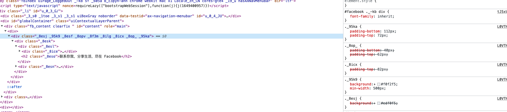

### 说明
css原子化是近两年比较火热的一个话题，第一次接触到CSS原子化是17年做rn项目使用react-native-web跨三端
的时候。当然这个库的作者最后去了fb做了css原子化方案。最近比较火的是 tailwindcss

####  以fb为例

几乎是最碎片化的css类名。优缺点就很明显。

####  以tailwindcss 为例子

相较于 fb方案，该方案语义性更强

