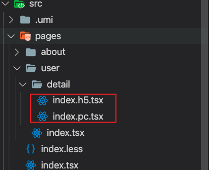

如果不考虑其他的小程序，app 端代码复用的情况，pc 和 h5 应该合并在同一个项目比较合适
理由如下：
1. 除开布局差异，通用性接口和逻辑可复用行较高
2. 部分页面布局 pc 和 h5 有较高的通用性的时候，可以使用用一个页面
3. 基础脚手架通用
具体实施以 umiJs 为例子（亦或是只考虑 index.tsx or index.h5.tsx）
src/app.tsx
```ts
/**
 * 渲染优先级逻辑 
 * pc端：index.pc > index
 * h5端：index.h5 > index
 */
export function patchRoutes({ routes }: any) {
  const path = window.location.pathname
  const isH5 = isMobile()
  if (isH5) {
    const h5Router = routes.find((r: any) => r.path == `${path}/index.h5`)
    if (h5Router) {
      routes.unshift({
        path,
        exact: true,
        component: h5Router.component
      });
    }
  } else {
    const pcRouter = routes.find((r: any) => r.path == `${path}/index.pc`)
    if (pcRouter) {
      routes.unshift({
        path,
        exact: true,
        component: pcRouter.component
      });
    }
  }
}
```


这样当访问/user 时候，不管是 pc 还是 h5渲染的是 user/index.tsx，
访问 user/detail 的时候 pc 端渲染 user/detail/index.pc.tsx,h5 端渲染的是 user/detail/index.h5.tsx
