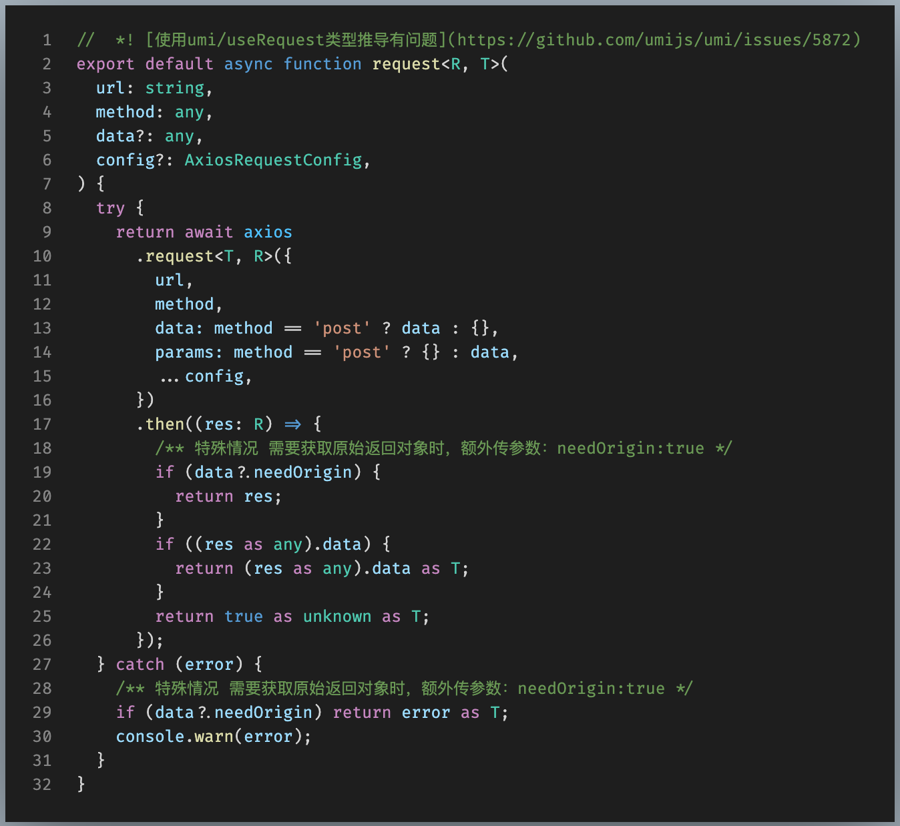

### 现状
现在用 swagger 自动生成接口文档已经成为通用做法，因此为了减少工作量，根据 swagger api 自动生成接口回调函数是值得去做的。简单的来说，要做的无非两点：
1. 生成入参，出参 所用到的 type or interface
2. 生成回调函数

### 这里以微服务架构为例子说明
1. 根据 swagger-resources 接口 获取所有微服务的 api-doc 接口数据  
2. 循环处理每个微服务的数据->3
3. 根据 definitions 生成 复合对象的 interface or type
4. 根据 paths 生成函数回调以及函数的入参&出参

### 注意事项
- 很多情况是 api 文档不规范，definitions or paths 中不合法字符居多(**|/|<<|>>|<|>|{|})等特殊字符，需要做好兼容
- 生成回调的时候注意返回对象的类型推导
- 为了统一类型推导，需要返回结果体尽量统一
- 接上，使用 axios 时进行类型推导时，可能会多一层 data 包裹体
- 结合 userRequest(从 umi 导入的类型推导有 bug，建议直接从 ahook 导入)

### 部分 demo处理情况
- 生成 api 回调 demo

- 使用 axios 封装 request 进行类型推导

