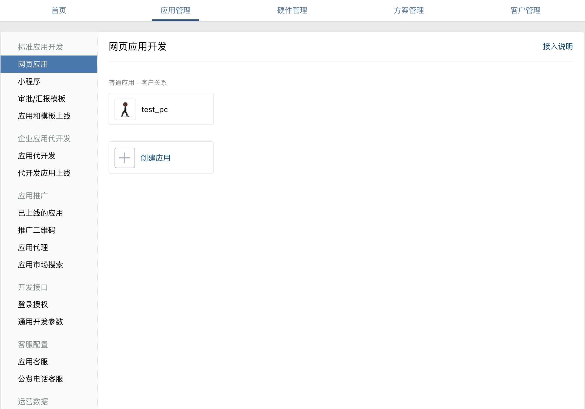

### 说明
1. 企业微信与微信的小程序可互通
2. 小程序可以通过 scheme url 打开
3. 企业微信网页应用可以指定桌面端的 url

### 部分流程
1. 申请成为[企业微信服务商](https://open.work.weixin.qq.com/)
2. 需要被添加为管理员有应用管理的权限
3. 登录[服务商后台管理](https://open.work.weixin.qq.com/wwopen/login)
4. 进入下图创建应用按照流程走下去

### 相关链接
1. [企业微信开发者中心](https://developer.work.weixin.qq.com/)
2. [通过链接打开小程序](https://developers.weixin.qq.com/miniprogram/dev/api-backend/open-api/url-scheme/urlscheme.generate.html)
3. [飞书服务商申请 ISV](https://open.feishu.cn/isv)
4. [钉钉服务商申请](https://partner.dingtalk.com/)

### 注意事项
1. 虽然前期只考虑企微平台，但是涉及调用企微/飞书/钉钉 层面的数据时候建议采用 adapter 模式
