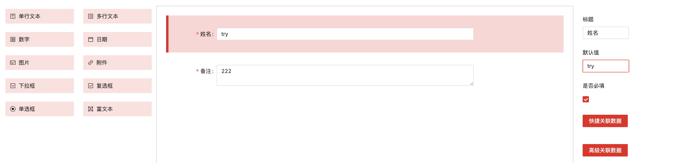
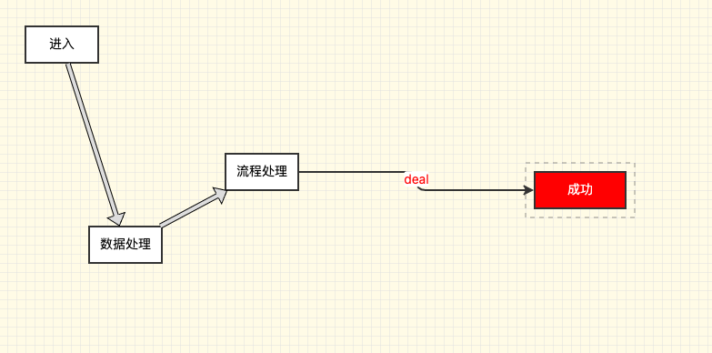

目前的低代码平台多以拖拽生成响应的页面或者表单为主(demo:如下)
    
这种低代码平台是较为常见。以销帮帮为例，一般都是这种低代码平台内嵌自身业务。需要说明的是，这种低代码平台在涉及具体业务或者做数据关联的时候，比较考验产品，如何让非专业人士能够快速理解并使用才是最重要的，以此来看最起码销帮帮做得不是很好。（有点诛心：我不知道什么是最好的，但是我觉得销帮帮肯定是不好的）

其实还有另一个方向的低代码平台，目前参与的公司并不多(demo:如下)

即流程相关的低代码平台，究其原因可能有一下三点
1. 许多公司并不涉及流程相关业务，亦或是没有考虑到这一点
2. 有相当的技术挑战：涉及代码层面与业务层面的扭转和用户的交互
3. 有相当的产品挑战：一是如何进行业务抽象，二是具有相对的专业性，如何把专业的东西给非专业人员使用
